<div align="center">

# Ion Trap Manufacturing

### From electrode geometry to validated electrostatic fields and evolutionary design search

[](https://www.python.org/)
[](#the-big-picture)
[](#how-the-island-ga-works)
[](#project-status)

<br>

> **A visual research codebase for planar ion-trap design.**  
> Build an electrode layout → compute its electric field → check numerical reliability → evolve better designs.

[Start here](#the-big-picture) ·
[Core visual guide](#core-in-one-picture) ·
[How BEM works](#how-bem-works) ·
[How Island GA works](#how-the-island-ga-works) ·
[Workflows](#workflow-roadmap) ·
[Run the code](#quick-start)

</div>

---

## The big picture

This repository is a **virtual design laboratory** for planar ion traps. It does not begin with a finished device: it begins with a candidate electrode layout and repeatedly answers one question:

> **Does this geometry create a useful, physically valid, and manufacturable trapping field — and can we improve it automatically?**

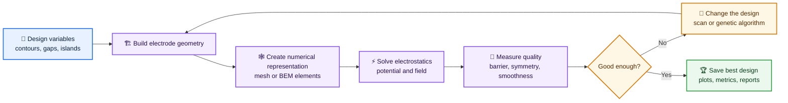

### In one sentence

The `core/` package is the reusable **engine room**; the `workflows/` folder contains the numbered **experiments** that drive that engine room in different ways.

---

## Core in one picture

Do not think of `core/` as a tree of files. Think of it as six cooperating workstations around one candidate electrode design.

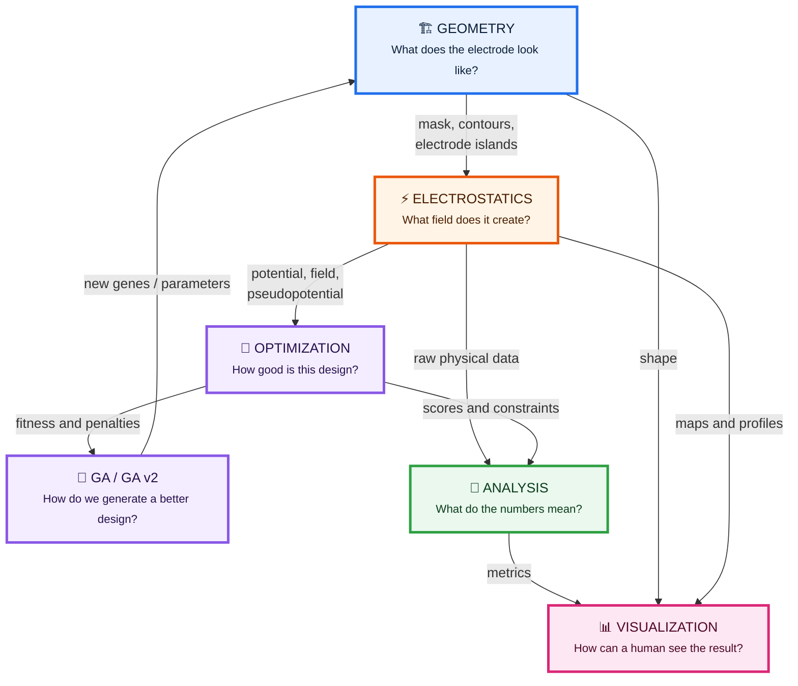

### Read this diagram from left to right

| Station | Human question | What it produces |
|---|---|---|
| 🏗️ **Geometry** | “What shape are we testing?” | Contours, masks, junctions, islands, manufacturability checks |
| ⚡ **Electrostatics** | “What electric field does this shape make?” | Potential, electric field, pseudopotential, BEM response |
| 🎯 **Optimization** | “Is the shape good or bad?” | Objectives, penalties, fitness score |
| 🧬 **GA / GA v2** | “How do we propose a better shape?” | New populations of candidate designs |
| 🔬 **Analysis** | “What changed and why?” | Metrics, comparisons, rankings, diagnostics |
| 📊 **Visualization** | “Can a person understand it at a glance?” | Maps, profiles, convergence curves, geometry views |

---

## The core loop

Every important workflow in the repository is a variation of the same closed loop.

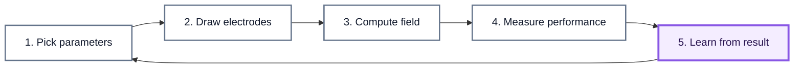

A parameter scan changes step 1 systematically. A local DOE samples step 1 near a reference design. A genetic algorithm learns from step 4 and intelligently proposes the next step 1.

---

## Geometry: how a design is built

The geometry folder is the **drawing and manufacturing-check station**. It transforms a small set of numbers into an electrode layout that can be simulated.

```mermaid
flowchart LR
    classDef input fill:#E8F1FF,stroke:#1F6FEB,stroke-width:2px,color:#0B1F3A;
    classDef build fill:#F4EDFF,stroke:#8957E5,stroke-width:2px,color:#25104D;
    classDef check fill:#FFF7E6,stroke:#D97706,stroke-width:2px,color:#542A00;
    classDef out fill:#EAF8EE,stroke:#2EA043,stroke-width:2px,color:#0B3D1B;

    A[🎛️ Parameters<br/>radii, offsets, knots,<br/>island choices]:::input
    B[📐 Junction template<br/>or base shape]:::build
    C[〰️ Inner and outer<br/>contours]:::build
    D[🧩 Local features<br/>islands, chamfers, windows]:::build
    E[⬛ RF / electrode mask]:::build
    F[🛠️ Manufacturability check<br/>gaps, overlap, feature size]:::check
    G[✅ Simulation-ready geometry]:::out

    A --> B --> C --> D --> E --> F --> G
```

### Geometry modules at a glance

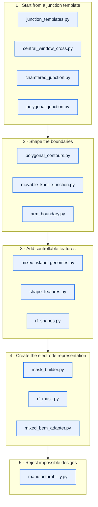

### Simple visual analogy

```text
Parameters        Geometry builder             Final electrode layout
──────────        ────────────────             ──────────────────────

  radius   ───►    draw central region     ─►       ┌───────┐
  offset   ───►    bend inner contour      ─►    ───┤       ├───
  knot     ───►    move local boundary     ─►       │  ion  │
  island   ───►    add/remove feature      ─►    ───┤       ├───
  gap      ───►    verify fabrication      ─►       └───────┘
```

---

## Electrostatics: how geometry becomes physics

The electrostatics folder is the **physics station**. It receives the electrode layout and calculates what the ion would “feel” above the surface.

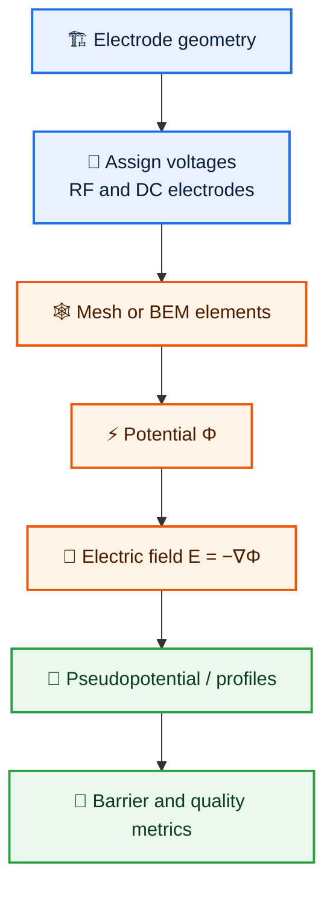

### What the user sees

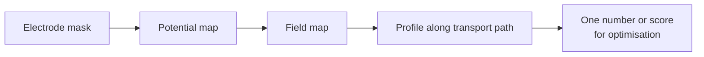

### Electrostatics modules at a glance

| Module | Picture in the pipeline | Role |
|---|---|---|
| `linear_trap.py` | 📏 baseline ruler | Creates a reference linear-trap model |
| `surface_2d.py` | 🗺️ surface field canvas | 2D surface electrostatic modelling helpers |
| `fixed_mesh.py` | 🕸️ repeatable grid | Keeps a stable discretisation for fair comparison |
| `bem_mesh.py` | 🧱 boundary tiles | Builds meshes for BEM-style evaluation |
| `bem.py` | ⚡ field calculator | Evaluates BEM-related electrostatics |
| `pseudopotential.py` | 🌊 effective RF landscape | Derives RF pseudopotential-related quantities |

---

## How BEM works

### The intuition

BEM turns a complicated electrode boundary into many small pieces. Instead of solving “the whole shape” at once, it asks how every small boundary piece contributes to the potential at a point in space.

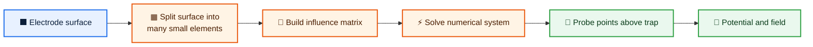

### The idea without equations

```text
One electrode surface

  ┌──────────────────────────┐
  │                          │
  │      continuous metal    │
  │                          │
  └──────────────────────────┘

becomes many small numerical tiles

  ┌──┬──┬──┬──┬──┬──┬──┬──┐
  │01│02│03│04│05│06│07│08│
  ├──┼──┼──┼──┼──┼──┼──┼──┤
  │09│10│11│12│13│14│15│16│
  └──┴──┴──┴──┴──┴──┴──┴──┘

Each tile contributes to the potential at a point above the trap.
The solver combines all contributions into one field estimate.
```

### Why BEM validation is important

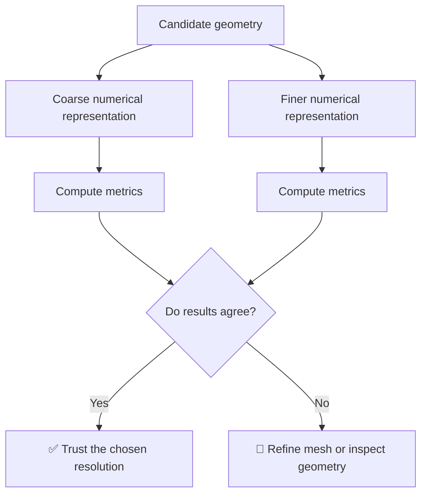

This is why `02_bem_validation.py` comes early in the workflow sequence: it checks whether the numerical model is reliable before expensive scans and GA runs reuse it.

---

## Optimization: how “good” is a design?

The optimization folder converts physical results into a clear decision: **keep this design, reject it, or improve it**.

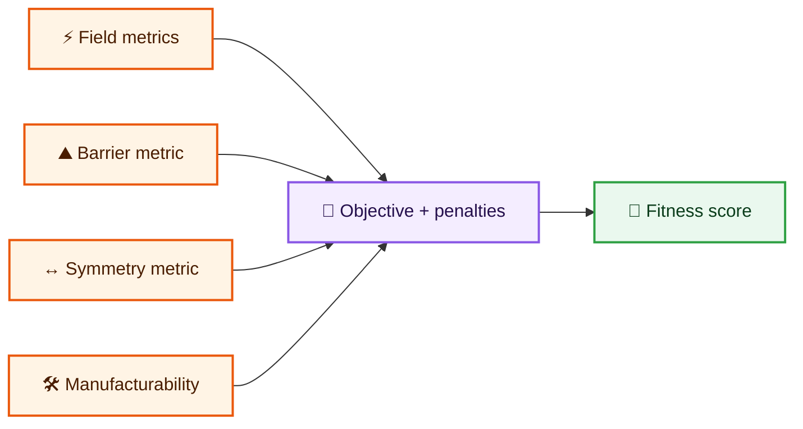

### Fitness is a report card

```text
Candidate design
      │
      ├── Field quality          good?     + points
      ├── Barrier behaviour      good?     + points
      ├── Symmetry               good?     + points
      ├── Smooth geometry        good?     + points
      └── Impossible to build?   yes?      − penalty
                                      │
                                      ▼
                              Final fitness score
```

The exact formulas and weights can differ by workflow. The important architectural rule is stable: **electrostatics produces facts; optimisation translates those facts into a choice.**

---

## How the Island GA works

This is the central visual explanation of the mixed-island genetic algorithm used by the later GA workflows.

### What is an “island”?

An island is a local, controllable electrode feature. In a mixed-island search, the algorithm may adjust smooth contour parameters **and** choose discrete local feature options.

```text
Contour-only design                     Mixed-island design
───────────────────                     ───────────────────

  outer contour                           outer contour
  ─────────────────                       ─────────────────
       ╲       ╱                              ╲   ●   ╱
        ╲_____/                                ╲_____/ 
        /     \                                /  ●  \
  ─────────────────                       ─────────────────
  inner contour                           inner contour + islands

Changes only smooth values.             Changes shape AND local features.
```

### One genome = one design recipe

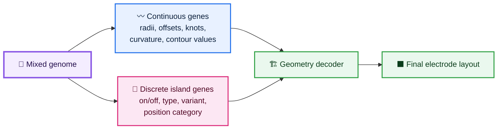

### The Island GA, visually

```mermaid
flowchart TD
    classDef start fill:#E8F1FF,stroke:#1F6FEB,stroke-width:2px,color:#0B1F3A;
    classDef genetic fill:#F4EDFF,stroke:#8957E5,stroke-width:2px,color:#25104D;
    classDef physics fill:#FFF4E5,stroke:#EA580C,stroke-width:2px,color:#4A1D00;
    classDef decision fill:#FFF7E6,stroke:#D97706,stroke-width:2px,color:#542A00;
    classDef end fill:#EAF8EE,stroke:#2EA043,stroke-width:2px,color:#0B3D1B;

    A[🎲 Create many random<br/>candidate genomes]:::start
    B[🧬 Decode one genome<br/>contours + island choices]:::genetic
    C[🏗️ Build electrode layout]:::genetic
    D[🛠️ Check geometry can exist<br/>no overlaps, invalid gaps, etc.]:::decision
    E[⚡ Evaluate field with<br/>mesh or BEM]:::physics
    F[📏 Measure barrier, field,<br/>symmetry, smoothness]:::physics
    G[🏅 Calculate fitness]:::genetic
    H[🥇 Keep strong candidates]:::genetic
    I[👪 Select parents]:::genetic
    J[✂️ Crossover<br/>mix useful traits]:::genetic
    K[🎲 Mutate<br/>small random changes]:::genetic
    L[🩹 Repair invalid children]:::decision
    M{Stop condition?}:::decision
    N[🏆 Best manufacturable<br/>geometry + report]:::end

    A --> B --> C --> D
    D -- valid --> E --> F --> G --> H --> I --> J --> K --> L --> M
    D -- invalid --> G
    L --> M
    M -- no --> B
    M -- yes --> N
```

### A population is a design tournament

```text
Generation 0                         Generation 1                         Generation N
────────────                         ────────────                         ────────────

  A  ── score 42                       A' ─ score 57                       Best ─ score 96
  B  ── score 18        evolve         B' ─ score 44        evolve         stable field
  C  ── score 61      ─────────►       C' ─ score 71      ─────────►       valid gaps
  D  ── score 33                       D' ─ score 62                       low barrier

 random designs                      useful traits combine               selected result
```

### What “crossover” means here

The GA creates a child by taking some traits from one parent and some from another.

```text
Parent A
  contour radius = 0.42
  inner knot     = 0.18
  island 1       = ON
  island type    = 2

Parent B
  contour radius = 0.56
  inner knot     = 0.31
  island 1       = OFF
  island type    = 4

                    crossover
                        │
                        ▼
Child
  contour radius = 0.56      ← inherited from B
  inner knot     = 0.18      ← inherited from A
  island 1       = ON        ← inherited from A
  island type    = 4         ← inherited from B
```

### What “mutation” means here

Mutation preserves exploration. It can gently move a contour parameter or switch a discrete island choice.

```text
Before mutation                 After mutation
───────────────                 ──────────────

radius = 0.56            →     radius = 0.59
knot   = 0.18            →     knot   = 0.18
island = ON              →     island = OFF
variant = 4              →     variant = 4
```

### Why mixed-island GA is more powerful than a simple parameter scan

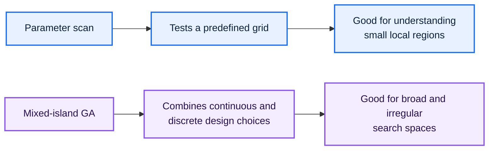

### Island GA modules

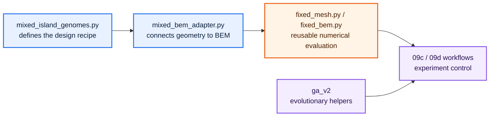

---

## Workflow 07f — local DOE

**File:** `workflows/07f_inner_contour_local_doe.py`

Workflow 07f is a **local Design of Experiments** study. It does not try to evolve a design. Instead, it carefully probes a neighbourhood around a reference inner contour to reveal sensitivity.


### What the output looks like conceptually

```text
Score
  ▲
  │              ● best local region
  │          ● ● ● ●
  │       ● ● ● ● ● ●
  │    ● ● ● ● ● ● ● ●
  │
  └────────────────────────────► inner contour parameter

A DOE does not guess blindly: it maps the nearby landscape.
```

---

## Workflow 07g — coupled contour scan

**File:** `workflows/07g_inner_outer_coupled_scan.py`

Workflow 07g studies two contour families together: the inner contour and the outer contour. The point is to reveal interaction effects that independent scans may miss.

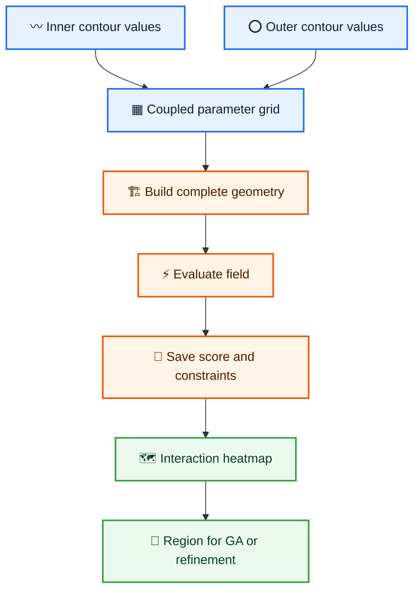

### Why this matters

```text
Independent scan assumption                 Coupled reality
───────────────────────────                 ───────────────

inner effect + outer effect                 inner effect depends on outer value

    inner  ─► score                              inner ─┐
    outer  ─► score                                      ├─► score
                                                        outer ─┘
```

The coupled scan identifies combinations that are useful together, not merely parameters that look good in isolation.

---

## Workflow roadmap

The workflows form a research story rather than a random collection of scripts.

```mermaid
flowchart LR
    classDef base fill:#E8F1FF,stroke:#1F6FEB,stroke-width:2px,color:#0B1F3A;
    classDef validate fill:#FFF4E5,stroke:#EA580C,stroke-width:2px,color:#4A1D00;
    classDef explore fill:#EAF8EE,stroke:#2EA043,stroke-width:2px,color:#0B3D1B;
    classDef optimise fill:#F4EDFF,stroke:#8957E5,stroke-width:2px,color:#25104D;

    A[01<br/>Linear baseline]:::base --> B[02<br/>BEM validation]:::validate
    B --> C[03–04<br/>Junction baseline<br/>and tracing]:::base
    C --> D[05 series<br/>Geometry and mesh scans]:::explore
    D --> E[06 series<br/>Sensitivity studies]:::explore
    E --> F[07f / 07g<br/>DOE and coupled scans]:::explore
    F --> G[08 series<br/>C4v and full geometry GA]:::optimise
    G --> H[09c / 09d<br/>Mixed-island GA]:::optimise
    H --> I[10<br/>Mixed topology GA]:::optimise
    I --> J[11<br/>Adaptive mesh / barrier focus]:::validate
```

| Workflow family | Main question |
|---|---|
| `01` | Can the baseline linear model be reproduced? |
| `02` | Can the numerical / BEM model be trusted? |
| `03–04` | What happens in a baseline single-junction layout? |
| `05` | Which geometric and mesh settings change results? |
| `06` | Which parameters are locally sensitive? |
| `07f` | What does the local inner-contour landscape look like? |
| `07g` | How do inner and outer contours interact? |
| `08` | Can structured C4v or full-geometry GA improve the design? |
| `09c / 09d` | Can mixed continuous/discrete island choices improve it further? |
| `10` | Can topology be searched as well as shape? |
| `11` | Can numerical refinement or barrier-only focus improve reliability and insight? |

---

## Workflow 09c and 09d

### 09c — mixed-island GA

`workflows/09c_mixed_island_ga.py` represents a mixed-island optimisation stage: the search has both smooth numerical parameters and discrete island-level design decisions.

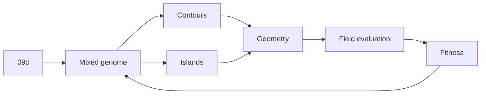

### 09d — extended mixed-island GA

`workflows/09d.py` is a larger extended workflow and is a natural candidate for the primary showcase of the current mixed-island GA branch.

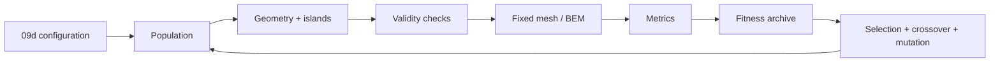

### What to show after real runs exist

```text
┌───────────────────────┐  ┌───────────────────────┐
│ Best geometry         │  │ Fitness over generation│
│                       │  │                       │
│   electrode image     │  │  score                │
│                       │  │    ▲                  │
│   + key metrics       │  │    │      ╭──────     │
│                       │  │    │  ╭───╯           │
└───────────────────────┘  └───────────────────────┘

┌───────────────────────┐  ┌───────────────────────┐
│ Potential / field map │  │ Constraint summary    │
│                       │  │                       │
│    real numerical     │  │  ✓ valid gaps         │
│    visualisation      │  │  ✓ symmetry threshold │
│                       │  │  ✓ barrier objective  │
└───────────────────────┘  └───────────────────────┘
```

---

## Workflow 11: two different goals

The repository contains two files numbered 11. They should be understood as separate late-stage studies.

### `11_adaptive_mesh.py` — spend numerical effort where it matters

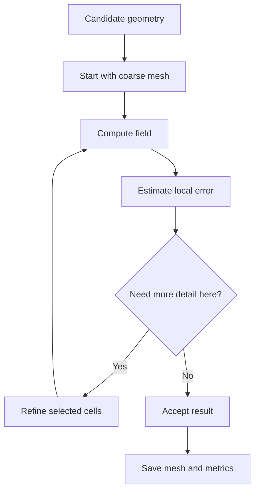

### `11_barrier_only.py` — isolate one physical target

```mermaid
flowchart LR
    A[Geometry] --> B[Electrostatics]
    B --> C[Potential profile along path]
    C --> D[Barrier extraction]
    D --> E[Barrier-only score]
    E --> F[Rank or optimise designs]
```

The adaptive mesh workflow asks, “Where do we need more numerical detail?” The barrier-only workflow asks, “How does geometry change this one important physical property?”

---

## Analysis and visualization: how raw numbers become insight

These folders exist so that a workflow does not end with a large array of values. It ends with something a researcher can inspect and compare.

```mermaid
flowchart LR
    A[Raw arrays<br/>potential, field, geometry] --> B[Analysis]
    B --> C[Metrics table]
    B --> D[Ranked candidates]
    B --> E[Validation diagnostics]
    C --> F[Visualization]
    D --> F
    E --> F
    F --> G[Plots, maps, profiles,<br/>convergence and reports]
```

### The visual language of this project

| Visual | What it answers immediately |
|---|---|
| Geometry plot | What electrode shape was evaluated? |
| Mesh plot | Where is numerical resolution concentrated? |
| Potential map | What does the electrostatic landscape look like? |
| Field map | Where are gradients high or low? |
| Path profile | What happens along the transport direction? |
| Heatmap | Which parameter combinations are promising? |
| Convergence curve | Is GA actually improving the population? |
| Top-candidate grid | Is the best result unique or robust? |

---

## Quick start

### Requirements

- Python 3.10 or newer
- Git
- `pip`
- A virtual environment tool such as `venv`, Conda, or Poetry

### Clone the repository

```bash
git clone https://github.com/LucysFan/Ion_trap_manufacturing.git
cd Ion_trap_manufacturing
```

### Create and activate an environment

**Linux / macOS**

```bash
python -m venv .venv
source .venv/bin/activate
```

**Windows PowerShell**

```powershell
python -m venv .venv
.venv\Scripts\Activate.ps1
```

### Install CPU dependencies

```bash
python -m pip install --upgrade pip
pip install -r requirements-cpu.txt
```

### Start with the simplest workflow

```bash
python workflows/01_linear_baseline.py
```

### Then validate the numerical layer

```bash
python workflows/02_bem_validation.py
```

> Run workflows from the repository root. Before running expensive scans or GA experiments, inspect the parameters, seed, output path, numerical resolution, and stopping conditions in the selected script.

---

## Reproducibility checklist

```mermaid
flowchart LR
    A[🔖 Commit hash] --> F[Reproducible run]
    B[🎲 Random seed] --> F
    C[🎛️ Full parameters] --> F
    D[🕸️ Mesh/BEM settings] --> F
    E[📁 Saved outputs] --> F
```

For every meaningful experiment, save:

- Git commit hash.
- Workflow filename.
- Random seed for stochastic procedures.
- Population size and generation count for GA.
- Geometry bounds and discrete island options.
- Mesh or BEM settings.
- Objective weights and penalty coefficients.
- Metrics table.
- Best geometry representation.
- Field and potential plots.
- A concise run summary.

### Suggested output structure

```text
reports/
└── 2026-09-26_09d_mixed_island_ga/
    ├── run_metadata.json
    ├── parameters.yaml
    ├── metrics.csv
    ├── best_geometry.json
    ├── potential_map.png
    ├── field_map.png
    ├── fitness_history.csv
    ├── top_candidates.csv
    └── summary.md
```

---

## Project status

| Area | Status |
|---|---|
| Parametric electrode geometry | Available |
| Linear-trap baseline | Available |
| BEM validation workflow | Available |
| Geometry and transition scans | Available |
| Local sensitivity studies | Available |
| Inner-contour local DOE | Available |
| Coupled inner/outer contour scan | Available |
| C4v and full-geometry GA experiments | Available |
| Mixed-island GA experiments | Active development |
| Mixed-topology GA | Experimental |
| Adaptive mesh study | Experimental |
| Barrier-focused study | Experimental |
| Formal API reference | Planned |
| Automated test coverage | In progress |

---

## Citation

If you use this repository in academic work, cite the repository and record the exact commit used for the calculations.

```text
LucysFan. Ion Trap Manufacturing:
Electrostatic modelling, numerical validation, and evolutionary optimisation
of planar ion-trap electrode geometries.
GitHub repository: https://github.com/LucysFan/Ion_trap_manufacturing
```

---

## License

A license file has not yet been added. Before sharing the repository broadly, add a `LICENSE` file and choose terms appropriate for the project.

| Option | When it fits |
|---|---|
| MIT | Broad reuse with minimal restrictions |
| BSD 3-Clause | Permissive academic-friendly reuse |
| Apache-2.0 | Permissive reuse with explicit patent grant |
| GPL-3.0 | Derivative software must remain open source |

---

<div align="center">

### 🏗️ Geometry → ⚡ Physics → 🎯 Metrics → 🧬 Evolution → 🏆 Better electrode design

</div>
